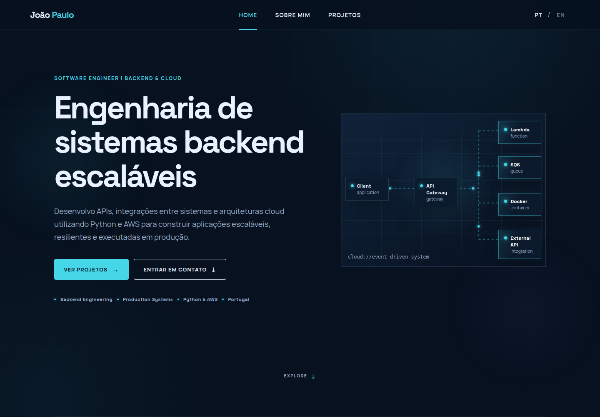

<div align="center">

# João Paulo — Software Engineering Portfolio

A bilingual engineering portfolio focused on Backend Engineering, Cloud, distributed systems, and the technical decisions behind software running in production.

[](https://react.dev/)
[](https://www.typescriptlang.org/)
[](https://vite.dev/)
[](https://joaosalesdev.github.io/portfolio/)
[](./LICENSE)

### [View the live portfolio →](https://joaosalesdev.github.io/portfolio/)

</div>

[](https://joaosalesdev.github.io/portfolio/)

## About

This repository contains my professional portfolio as a Software Engineer specializing in backend and cloud systems. It presents selected production experience through technical case studies instead of treating projects as isolated visual samples.

Each case study connects a business problem to implementation responsibilities, architectural decisions, system flows, reliability concerns, and outcomes. The portfolio is designed to complement the source code: the website explains what was built and why, while this repository shows how the frontend is organized and maintained.

## Features

- Responsive interface for desktop, tablet, and mobile
- Dark technical UI with restrained motion and reduced-motion support
- Portuguese and English content
- Selected production projects presented as case studies
- Architecture and workflow diagrams built as React components
- Client-side routing between pages and case studies
- Reusable components and typed content models
- Automated build and deployment through GitHub Actions

## Tech Stack

### Frontend

- **React 19** — component-based user interface
- **TypeScript** — typed content, props, and domain models
- **React Router** — SPA navigation and case-study routes
- **CSS** — responsive layouts, visual system, and animations
- **Manrope and Space Grotesk** — self-hosted through Fontsource packages

### Development

- **Vite** — local development and production bundling
- **ESLint** — static analysis and code-quality checks
- **npm** — dependency and script management

### Deployment

- **GitHub Actions** — automated build pipeline
- **GitHub Pages** — static hosting

## Project Structure

```text
portfolio/
├── .github/workflows/       # GitHub Pages deployment workflow
├── public/                  # Static assets and portfolio preview
└── src/
    ├── components/layout/   # Shared header and footer
    ├── features/
    │   ├── case-studies/     # Case-study pages and technical diagrams
    │   ├── home/             # Home-specific components
    │   └── projects/         # Project cards and media components
    ├── pages/               # Top-level route components
    ├── App.tsx              # Routing and language state
    ├── content.ts          # Portuguese and English portfolio content
    ├── main.tsx             # Application entry point
    └── types.ts            # Shared TypeScript domain types
```

The feature-based organization keeps domain-specific components close to their context while shared layout and types remain easy to locate.

## Running Locally

### Requirements

- Node.js 22, matching the deployment workflow
- npm

### Installation

```bash
git clone https://github.com/joaosalesdev/portfolio.git
cd portfolio
npm install
npm run dev
```

Vite will print the local development URL in the terminal.

### Quality checks and production build

```bash
npm run lint
npm run build
npm run preview
```

The production output is generated in `dist/`. `npm run preview` serves that build locally for verification.

## Deployment

The portfolio is hosted on GitHub Pages. Every push to the `main` branch triggers the workflow in `.github/workflows/deploy.yml`, which:

1. Checks out the repository.
2. Installs dependencies with `npm ci`.
3. Creates a production build with `npm run build`.
4. Publishes the `dist/` artifact to GitHub Pages.

The workflow can also be started manually through `workflow_dispatch`.

## Design Principles

- **Component-based architecture:** pages are assembled from focused components with explicit responsibilities.
- **Feature-oriented organization:** home, projects, and case studies keep their implementation details grouped by domain.
- **Typed content model:** portfolio content follows shared TypeScript types across both supported languages.
- **Responsive-first behavior:** layouts and interactions adapt to smaller screens without reducing content access.
- **Accessible motion:** animations remain subtle and respect the user's reduced-motion preference.
- **Maintainability:** content, routing, presentation, and domain types are separated to make updates predictable.
- **Performance awareness:** the application is statically built and uses local font packages rather than runtime font requests.

## Purpose

This project is part of my professional presence as a **Software Engineer | Backend & Cloud**. It documents real development experience and gives recruiters, Engineering Managers, Tech Leads, and fellow engineers a clear path from project context to technical implementation.

The repository is intentionally public so the portfolio can be evaluated as both a product and a maintained software project.

## License

This project is available under the [MIT License](./LICENSE).
